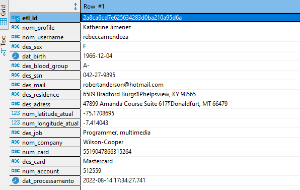
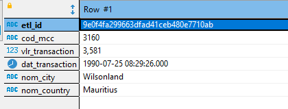
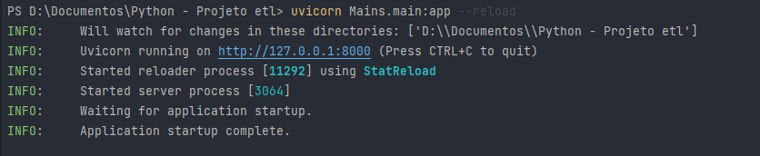

# Python ETL - Api cadastro e transações
## Objetivos:
- Criar api que irá gerar os dados 
- Coletar e tratar dados da api 
- Armazená-los em banco de dados

## Pré-requisitos:
- Banco de dados PostgreSQL
- python 3.6+
- Uvicorn
- json lib
- faker lib
- fastapi lib
- ccard lib
- urllib3 lib
- psycopg2 lib

## Funcionamento:
- Após a iniciação da api os dados irão ser gerados aleatóriamente toda vez que for feito um request
- A api é composta por duas partes, sendo elas: 
  - Profiles -> dados de cadastro de pessoas ficticias
  - Transactions -> dados de transações das pessoas cadastradas
- Os dados serão coletados por dois arquivos "runs" e logo tratados e inseridos num banco de dados postgre
- Os "runs" podem ser executados simultaneamente e para sempre

## Exemplos:
- ### Profile:
  - {"profile":{"job":"Teacher, secondary school","company":"Pierce-Pena","ssn":"532-34-4894","residence":"0087 Karen Views Suite 125\nLake Kaitlynfurt, ID 25618","current_location":[-36.6710675,-58.973187],"blood_group":"A-","website":["http://garcia.com/","https://wells-james.com/","https://www.cameron.info/","http://www.knight.com/"],"username":"travis57","name":"Richard Johnston","sex":"M","address":"5579 Jackson Ford Apt. 680\nNorth Teresaside, MI 32374","mail":"alyssa54@yahoo.com","birthdate":"2022-05-18"},"card-number":5484216146596388,"card-type":"Mastercard","account":"113503","dat_processamento":"2022-08-14T18:14:29.664177"}
  - 
- ### Transactions:
  - {"id":"8fd05d577a6d596a516f18d94ef466ac","mcc":"8175","value":6222,"date":"1999-10-19T11:01:10","city":"South Kathryn","country":"Sri Lanka"}
  - 

## Como utilizar:
1. #### Após clonar o repositório inicie o servidor da api com o comando:
    ```
    uvicorn Mains.main:app --reload
    ```
   
2. #### Recrie toda estrutura de banco de dados localmente
3. #### Inicie o arquivo: run_get_api_infos.py para alimentação da base de cadastro
4. #### Inicie o arquivo: run_get_api_transactions.py para alimentação da base de transações
5. #### Divirta-se


